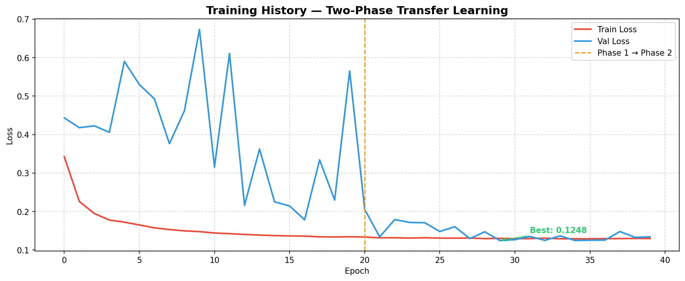

# 🌊 Underwater Image Enhancement

A deep learning pipeline for underwater image enhancement using classical computer vision preprocessing and a **U-Net CNN with EfficientNetB0 transfer learning**. Built as a research portfolio project for PhD applications in Computer Vision and Deep Learning.

---

## 🎯 Results

Evaluated on 50 images from the UIEB benchmark dataset:

| Method | PSNR (dB) | SSIM | ΔPSNR | ΔSSIM |
|---|---|---|---|---|
| Raw Baseline | 15.73 | 0.7151 | — | — |
| Classical CV | 17.13 | 0.8000 | +1.40 | +0.0849 |
| **CNN (U-Net)** | **18.76** | **0.8141** | **+3.03** | **+0.0990** |

### Visual Results — Multi-Sample Grid


### Training History



### Metric Improvements


---

## 📖 Overview

Underwater images suffer from three primary degradation types:

| Problem | Cause | Solution Applied |
|---|---|---|
| **Colour distortion** | Water absorbs red light first | Grey World colour correction |
| **Low contrast** | Haze and light scattering | CLAHE contrast enhancement |
| **Blur** | Water turbulence and motion | Unsharp masking |

This project implements and compares two complementary approaches:

1. **Classical CV Pipeline** — deterministic image processing using OpenCV
2. **Deep Learning (U-Net)** — end-to-end learned enhancement using transfer learning

---

## 🏗️ Architecture

### Classical CV Pipeline

```
Raw Image
    ↓
Grey World Colour Correction   (fixes blue/green cast)
    ↓
CLAHE Contrast Enhancement     (improves local contrast tile-by-tile)
    ↓
Unsharp Masking                (sharpens edges via Gaussian subtraction)
    ↓
Enhanced Image
```

### U-Net with EfficientNetB0 Encoder

```
Input (256×256×3)
        ↓
┌─────────────────────────────────┐
│  ENCODER — EfficientNetB0       │
│  Pretrained on ImageNet         │
│  block2 → edges / textures      │
│  block3 → simple shapes         │
│  block4 → complex patterns      │
│  block6 → object parts          │
│  top    → semantic features     │
└────────────┬────────────────────┘
             │  skip connections
┌────────────▼────────────────────┐
│  DECODER — Progressive          │
│  Upsampling                     │
│  256→128→64→32→16 filters       │
│  Upsample → Concat → Conv×2     │
└────────────┬────────────────────┘
             ↓
      Conv 1×1 + Sigmoid
             ↓
   Output (256×256×3) ∈ [0,1]
```

### Two-Phase Transfer Learning Strategy

| Phase | Epochs | Encoder | Learning Rate | Purpose |
|---|---|---|---|---|
| Phase 1 | 20 | Frozen | 1e-4 | Train decoder only — stable initialisation |
| Phase 2 | 20 | Unfrozen | 1e-5 | Full fine-tuning with gradient clipping |

**Loss Function:** Combined MAE + SSIM

```
loss = 0.5 × MAE + 0.5 × (1 − SSIM)
```

**Callbacks:** ModelCheckpoint · EarlyStopping (patience=10) · ReduceLROnPlateau (factor=0.5, patience=5)

---

## 📁 Project Structure

```
underwater-image-enhancement/
├── 📁 assets/                        # Result images for README and demo
│   ├── cnn_samples.png               # CNN validation results grid
│   ├── sample_grid.png               # Classical CV multi-sample grid
│   ├── training_history.png          # Two-phase training loss chart
│   └── metrics_chart.png             # PSNR/SSIM comparison chart
├── 📁 data/                          # Dataset — not tracked by Git
│   ├── raw/                          # 890 degraded underwater images
│   ├── reference/                    # 890 clean reference images
│   └── results/                      # Enhancement outputs
├── 📁 models/                        # Trained weights — not tracked by Git
│   └── unet_efficientnetb0.keras
├── 📁 notebooks/
│   └── training.ipynb                # Google Colab GPU training notebook
├── 📁 src/
│   ├── __init__.py                   # Environment verification
│   ├── dataset.py                    # Data loading and pair matching
│   ├── enhance.py                    # Classical CV enhancement pipeline
│   ├── evaluate.py                   # Three-way PSNR/SSIM evaluation
│   ├── train.py                      # U-Net model definition and config
│   └── visualise.py                  # Result visualisation and charts
├── app.py                            # Gradio interactive demo app
├── requirements.txt                  # Python dependencies
└── README.md
```

---

## ⚙️ Installation

### Prerequisites
- Python 3.11
- Git

### Steps

```bash
# 1. Clone the repository
git clone https://github.com/danielakbank/underwater-image-enhancement.git
cd underwater-image-enhancement

# 2. Create and activate virtual environment
python -m venv venv

# Windows
venv\Scripts\activate

# Mac/Linux
source venv/bin/activate

# 3. Install dependencies
pip install -r requirements.txt

# 4. Verify environment
python src/__init__.py
```

---

## 🚀 Usage

### Verify Environment
```bash
python src/__init__.py
```

### Run Classical CV Enhancement
```bash
python src/enhance.py
```

### Run Three-Way Evaluation
```bash
# Evaluates Raw vs Classical CV vs CNN on 50 image pairs
python src/evaluate.py
```

### Generate Visualisations
```bash
python src/visualise.py
```

### Launch Gradio Demo App
```bash
python app.py
```

---

## 🧪 Training

Training requires a GPU. We use Google Colab's free T4 GPU.

### 1. Prepare Dataset on Google Drive

```
My Drive/
└── underwater-data/
    ├── raw/          ← 890 degraded images
    └── reference/    ← 890 clean reference images
```

### 2. Open Training Notebook on Colab

1. Go to [colab.research.google.com](https://colab.research.google.com)
2. File → Open notebook → GitHub tab
3. Enter: `https://github.com/danielakbank/underwater-image-enhancement`
4. Select `notebooks/training.ipynb`
5. Runtime → Change runtime type → **T4 GPU**
6. Run cells top to bottom

### Training Configuration

```python
CONFIG = {
    "image_size"    : (256, 256),
    "batch_size"    : 8,
    "epochs"        : 50,
    "learning_rate" : 1e-4,
    "val_split"     : 0.15,
}
```

---

## 🎮 Demo App

```bash
python app.py
```

- Upload any degraded underwater image
- See **Classical CV** and **CNN** enhanced outputs side by side
- View perceptual quality indicators (colourfulness, contrast, sharpness)
- Benchmark results displayed in the interface
- Public shareable link generated automatically via `share=True`

---

## 📊 Dataset

**UIEB — Underwater Image Enhancement Benchmark**

- 890 paired raw/reference underwater images
- Covers diverse underwater conditions and scenes
- Download: [https://li-chongyi.github.io/proj_benchmark.html](https://li-chongyi.github.io/proj_benchmark.html)

> Dataset is not included in this repository due to size.
> Download separately and place images in `data/raw/` and `data/reference/`.

---

## 🛠️ Tech Stack

| Tool | Version | Purpose |
|---|---|---|
| Python | 3.11 | Core language |
| TensorFlow | 2.16 | Deep learning framework |
| OpenCV | 4.8+ | Classical image processing |
| NumPy | 2.0+ | Array operations |
| scikit-image | 0.21+ | PSNR / SSIM metrics |
| Matplotlib | 3.7+ | Visualisation |
| Gradio | 4.0+ | Interactive demo app |
| Google Colab | — | GPU training environment |

---

## 📄 License

MIT License — see [LICENSE](LICENSE) for details.

---

## 👤 Author

**Daniel** — [@danielakbank](https://github.com/danielakbank)

---

*Built for PhD application portfolio — Computer Vision / Deep Learning*
